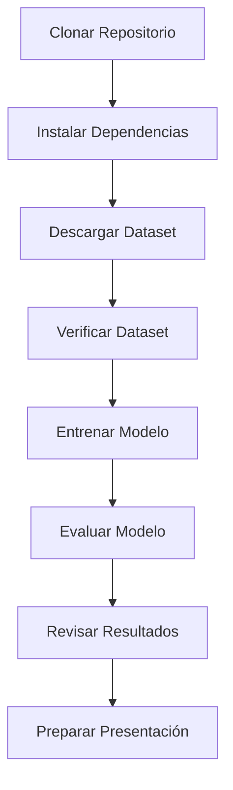

Esta página documenta la estructura completa del proyecto, explicando el propósito de cada carpeta y módulo.

## Árbol de Directorios

```
proyectoia/
├── data/                           # Dataset (descargar de Kaggle)
│   └── chest_xray/
│       ├── train/
│       │   ├── NORMAL/
│       │   └── PNEUMONIA/
│       └── test/
│           ├── NORMAL/
│           └── PNEUMONIA/
├── models/                         # Modelos entrenados
│   ├── best_model.keras           # Mejor modelo según validación
│   └── final_model.keras          # Modelo al final del entrenamiento
├── results/                        # Gráficas y resultados
│   ├── training_history.png       # Evolución del entrenamiento
│   ├── confusion_matrix.png       # Matriz de confusión
│   ├── roc_curve.png              # Curva ROC y AUC
│   └── predictions.png            # Ejemplos de predicciones
├── src/                           # Código fuente
│   ├── model.py                   # Arquitectura CNN
│   ├── data_loader.py             # Carga de datos
│   ├── train.py                   # Entrenamiento
│   └── evaluate.py                # Evaluación
├── main.py                         # Script principal
├── verificar_dataset.py            # Verificador de dataset
├── PLANTEAMIENTO.md               # Paso 1: Definición del problema
├── DISEÑO_MODELO.md               # Paso 2: Arquitectura del modelo
├── INSTRUCCIONES_DATASET.md       # Paso 3: Instrucciones del dataset
├── GUIA_COMPLETA.md               # Guía completa de implementación
├── LEEME.md                        # Guía rápida en español
├── README.md                       # Documentación principal
├── Pipfile                         # Dependencias del proyecto
└── Pipfile.lock                    # Versiones bloqueadas
```

---

## Carpetas Principales

### data/

<Card title="Dataset" icon="database">
  Contiene las radiografías de tórax descargadas de Kaggle.
  
  **Tamaño**: ~1.15 GB
  
  **No incluido en el repositorio** - Debes descargarlo manualmente
</Card>

**Estructura esperada**:

```
data/chest_xray/
├── train/
│   ├── NORMAL/          # 1,341 imágenes
│   └── PNEUMONIA/       # 3,875 imágenes
└── test/
    ├── NORMAL/          # 234 imágenes
    └── PNEUMONIA/       # 390 imágenes
```

<Info>
  Total: **5,863 imágenes** de rayos X de tórax en formato JPEG
</Info>

### models/

<Card title="Modelos Entrenados" icon="brain">
  Almacena los modelos de Keras entrenados durante la ejecución.
</Card>

**Archivos generados**:

| Archivo | Descripción | Cuándo se genera |
|---------|-------------|------------------|
| `best_model.keras` | Mejor modelo según validación | Durante entrenamiento (checkpoint) |
| `final_model.keras` | Modelo al finalizar todas las épocas | Al terminar entrenamiento |

<Tip>
  El archivo `best_model.keras` es el que se usa para evaluación, ya que tiene el mejor desempeño en el conjunto de validación.
</Tip>

### results/

<Card title="Visualizaciones" icon="chart-line">
  Contiene todas las gráficas y resultados de evaluación.
</Card>

**Archivos generados**:

<Tabs>
  <Tab title="training_history.png">
    Gráficas de evolución durante el entrenamiento:
    - Loss (pérdida) en train y validación
    - Accuracy (precisión) en train y validación
    
    Útil para identificar overfitting o underfitting.
  </Tab>
  
  <Tab title="confusion_matrix.png">
    Matriz de confusión mostrando:
    - Verdaderos positivos (TP)
    - Verdaderos negativos (TN)
    - Falsos positivos (FP)
    - Falsos negativos (FN)
    
    Incluye métricas: Accuracy, Precision, Recall, F1-Score
  </Tab>
  
  <Tab title="roc_curve.png">
    Curva ROC (Receiver Operating Characteristic):
    - Eje X: Tasa de falsos positivos
    - Eje Y: Tasa de verdaderos positivos
    - Incluye el valor AUC (Area Under Curve)
    
    Un AUC cercano a 1.0 indica excelente desempeño.
  </Tab>
  
  <Tab title="predictions.png">
    Grid de ejemplos visuales mostrando:
    - Imagen original del rayo X
    - Etiqueta real (NORMAL/PNEUMONIA)
    - Predicción del modelo
    - Probabilidad de la predicción
    
    Útil para presentaciones y demos.
  </Tab>
</Tabs>

### src/

<Card title="Código Fuente" icon="code">
  Módulos principales de la aplicación.
</Card>

Esta carpeta contiene todo el código Python del proyecto, organizado en 4 módulos principales.

---

## Módulos del Código

### src/model.py

**Arquitectura de la CNN**

<CodeGroup>
```python Propósito
# Define la arquitectura de la red neuronal convolucional
# 3 bloques convolucionales + capas densas
```

```python Función Principal
def create_model(input_shape=(224, 224, 3), num_classes=2):
    """
    Crea y retorna el modelo CNN.
    
    Args:
        input_shape: Dimensiones de la imagen de entrada
        num_classes: Número de clases (2: NORMAL, PNEUMONIA)
    
    Returns:
        model: Modelo de Keras compilado
    """
```
</CodeGroup>

**Componentes**:
- 3 capas convolucionales (32, 64, 128 filtros)
- MaxPooling después de cada convolución
- Capa Flatten
- Capa Dense (128 neuronas)
- Dropout (0.5) para regularización
- Capa de salida (2 neuronas, Softmax)

**Ejecutar**:
```bash
pipenv run python src/model.py
```

Muestra un resumen del modelo con el número total de parámetros.

### src/data_loader.py

**Cargador de Datos con Augmentation**

<CodeGroup>
```python Propósito
# Carga las imágenes del dataset
# Aplica data augmentation para mejorar generalización
# Prepara los datos para entrenamiento
```

```python Funciones Principales
def load_data(data_dir, batch_size=32, img_size=(224, 224)):
    """
    Carga los datos de train y test con augmentation.
    
    Returns:
        train_generator, test_generator
    """
```
</CodeGroup>

**Data Augmentation aplicado**:
- Rotación aleatoria (±15 grados)
- Desplazamiento horizontal/vertical (±10%)
- Zoom aleatorio (±20%)
- Flip horizontal
- Rescalado a [0, 1]

<Warning>
  El data augmentation solo se aplica al conjunto de entrenamiento, no al de test.
</Warning>

### src/train.py

**Entrenamiento del Modelo**

<CodeGroup>
```python Propósito
# Entrena el modelo CNN con el dataset
# Implementa early stopping y checkpoints
# Guarda el mejor modelo y visualizaciones
```

```python Configuración
EPOCHS = 20
BATCH_SIZE = 32
LEARNING_RATE = 0.001
EARLY_STOP_PATIENCE = 5
```
</CodeGroup>

**Callbacks implementados**:

<Tabs>
  <Tab title="ModelCheckpoint">
    Guarda el mejor modelo según validation accuracy:
    ```python
    ModelCheckpoint(
        'models/best_model.keras',
        monitor='val_accuracy',
        save_best_only=True
    )
    ```
  </Tab>
  
  <Tab title="EarlyStopping">
    Detiene el entrenamiento si no hay mejora:
    ```python
    EarlyStopping(
        monitor='val_loss',
        patience=5,
        restore_best_weights=True
    )
    ```
  </Tab>
  
  <Tab title="ReduceLROnPlateau">
    Reduce el learning rate si hay estancamiento:
    ```python
    ReduceLROnPlateau(
        monitor='val_loss',
        factor=0.5,
        patience=3
    )
    ```
  </Tab>
</Tabs>

**Ejecutar**:
```bash
pipenv run python src/train.py
```

**Output esperado**:
```
Epoch 1/20
163/163 [==============================] - 45s 276ms/step
loss: 0.3456 - accuracy: 0.8234 - val_loss: 0.2891 - val_accuracy: 0.8567
...
Entrenamiento completado
Mejor modelo guardado en: models/best_model.keras
```

### src/evaluate.py

**Evaluación del Modelo**

<CodeGroup>
```python Propósito
# Evalúa el modelo entrenado en el test set
# Calcula métricas completas
# Genera visualizaciones de resultados
```

```python Métricas Calculadas
- Accuracy (Exactitud)
- Precision (Precisión)
- Recall (Sensibilidad)
- F1-Score (Media armónica)
- AUC-ROC (Área bajo la curva)
- Confusion Matrix (Matriz de confusión)
```
</CodeGroup>

**Ejecutar**:
```bash
pipenv run python src/evaluate.py
```

**Output esperado**:
```
Evaluando modelo en test set...

Métricas de Evaluación:
========================
Accuracy:  0.8526
Precision: 0.8234
Recall:    0.9231
F1-Score:  0.8705
AUC-ROC:   0.9234

Gráficas guardadas en results/
```

---

## Scripts Auxiliares

### main.py

**Script Principal de Ejecución**

<Card title="Punto de Entrada" icon="play">
  Script unificado para ejecutar train y/o evaluate.
</Card>

**Uso**:

<CodeGroup>
```bash Todo (Train + Evaluate)
python main.py all
```

```bash Solo Entrenar
python main.py train
```

```bash Solo Evaluar
python main.py evaluate
```
</CodeGroup>

### verificar_dataset.py

**Verificador de Dataset**

<Card title="Validación" icon="check">
  Verifica que el dataset esté correctamente descargado y estructurado.
</Card>

**Ejecutar**:
```bash
pipenv run python verificar_dataset.py
```

**Output esperado**:
```
Verificando dataset...
✓ Carpeta data/chest_xray/ encontrada
✓ Train set: 5,216 imágenes
  - NORMAL: 1,341
  - PNEUMONIA: 3,875
✓ Test set: 624 imágenes
  - NORMAL: 234
  - PNEUMONIA: 390

Dataset verificado correctamente!
```

---

## Archivos de Documentación

### Archivos Markdown

<CardGroup cols={2}>
  <Card title="PLANTEAMIENTO.md" icon="bullseye">
    **Paso 1**: Definición del problema biomédico y justificación
  </Card>
  <Card title="DISEÑO_MODELO.md" icon="diagram-project">
    **Paso 2**: Arquitectura CNN y justificación técnica
  </Card>
  <Card title="INSTRUCCIONES_DATASET.md" icon="database">
    **Paso 3**: Cómo descargar y preparar el dataset
  </Card>
  <Card title="GUIA_COMPLETA.md" icon="book">
    **Pasos 1-4**: Guía completa de implementación
  </Card>
</CardGroup>

<CardGroup cols={2}>
  <Card title="README.md" icon="file">
    Documentación principal del proyecto en inglés
  </Card>
  <Card title="LEEME.md" icon="file">
    Guía rápida en español para empezar
  </Card>
</CardGroup>

---

## Gestión de Dependencias

### Pipfile

**Dependencias del proyecto**:

```toml
[packages]
tensorflow = "*"
keras = "*"
numpy = "*"
matplotlib = "*"
scikit-learn = "*"
pillow = "*"

[requires]
python_version = "3.9"
```

### Instalación

<Steps>
  <Step title="Instalar pipenv">
    ```bash
    pip install pipenv
    ```
  </Step>
  
  <Step title="Instalar dependencias">
    ```bash
    pipenv install
    ```
  </Step>
  
  <Step title="Activar entorno">
    ```bash
    pipenv shell
    ```
  </Step>
</Steps>

---

## Flujo de Trabajo

El flujo típico de trabajo con este proyecto es:



<Steps>
  <Step title="Setup inicial">
    ```bash
    git clone <repo>
    cd proyectoia
    pipenv install
    ```
  </Step>
  
  <Step title="Preparar datos">
    - Descargar dataset de Kaggle
    - Extraer en `data/chest_xray/`
    - Ejecutar `verificar_dataset.py`
  </Step>
  
  <Step title="Entrenar">
    ```bash
    pipenv run python src/train.py
    ```
    Espera 15-30 minutos
  </Step>
  
  <Step title="Evaluar">
    ```bash
    pipenv run python src/evaluate.py
    ```
    Genera gráficas en `results/`
  </Step>
  
  <Step title="Analizar">
    Revisa:
    - `results/training_history.png`
    - `results/confusion_matrix.png`
    - `results/roc_curve.png`
    - `results/predictions.png`
  </Step>
</Steps>

---

## Resumen

Esta estructura modular facilita:

<CardGroup cols={2}>
  <Card title="Mantenibilidad" icon="wrench">
    Código organizado en módulos claros y separados
  </Card>
  <Card title="Escalabilidad" icon="arrow-up">
    Fácil agregar nuevas funcionalidades
  </Card>
  <Card title="Reproducibilidad" icon="rotate">
    Dependencias versionadas con Pipfile.lock
  </Card>
  <Card title="Claridad" icon="lightbulb">
    Documentación extensa en archivos .md
  </Card>
</CardGroup>
